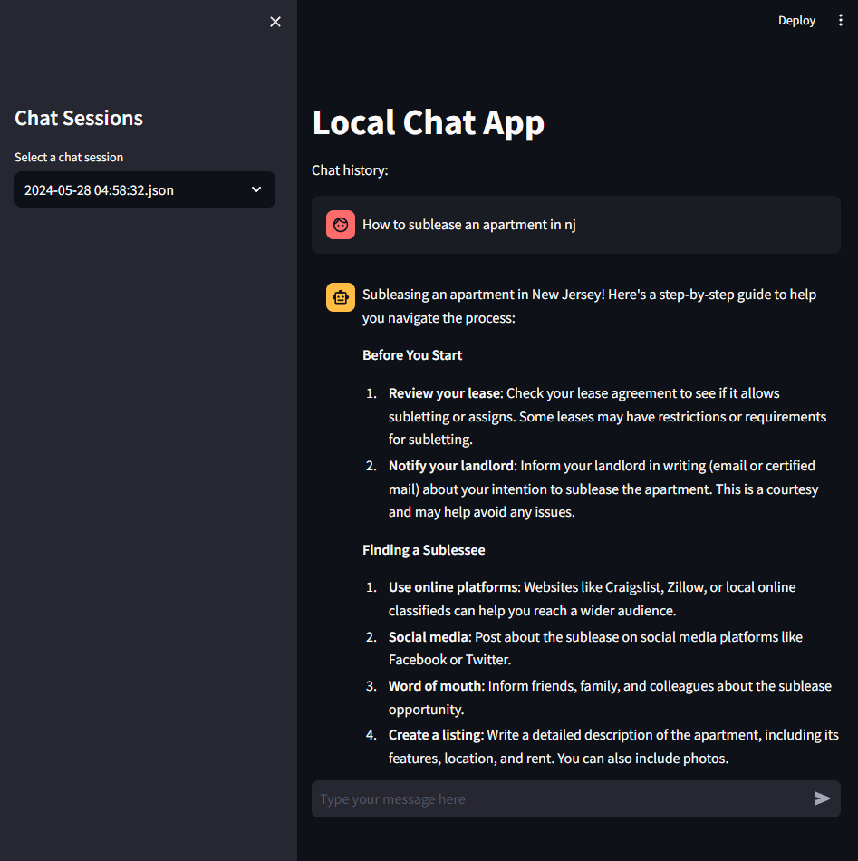

# Local Free Multi-models Chatbot App 
An efficient and reliable chatbot using HuggingFace's open-source models (ex. Llama 3 from Meta). Keeping everything local and secured.

<div align="center">
  
</div>
<br>

### Features
- Saving and loading chat history from side bar
- Intergrating with various open source models (currently supports llama 3)
- Interactive UI for chatting!

### Getting Started
1. Make sure your machine has GPU enabled. Checking it with:
   
```bash
nvidia-smi
```

2. Create a python3 virtual environment and activate it.
   
```bash
 python3 -m venv <YOUR_ENV_NAME>
```
- To activate on windows
```bash
.\myenv\Scripts\activate
```
- on Linux or macOS:
```bash
source myenv/bin/activate
```
- To deactivate later:  
```bash
deactivate
```

3. Install required dependencies:
```bash
python3 -m pip install -r requirements.txt
```

4. Run the app using:
```bash
streamlit run app.py
```

Having fun chatting!


